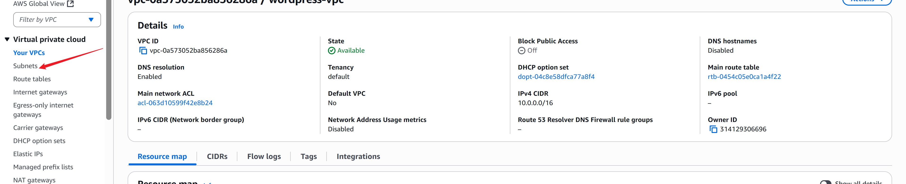
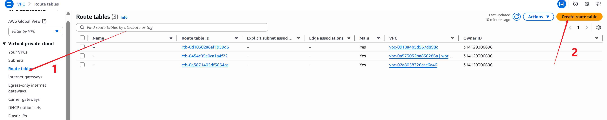
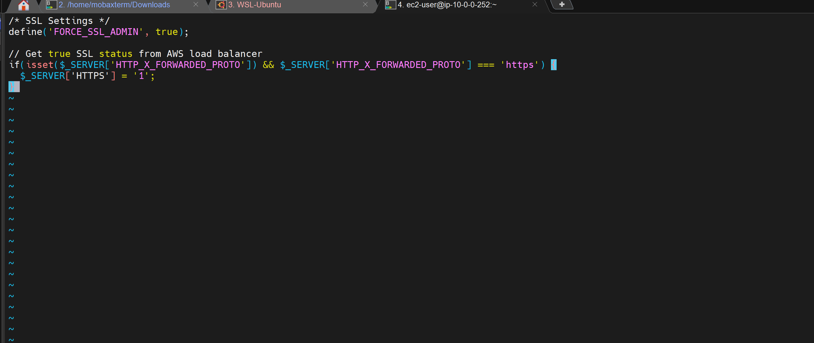
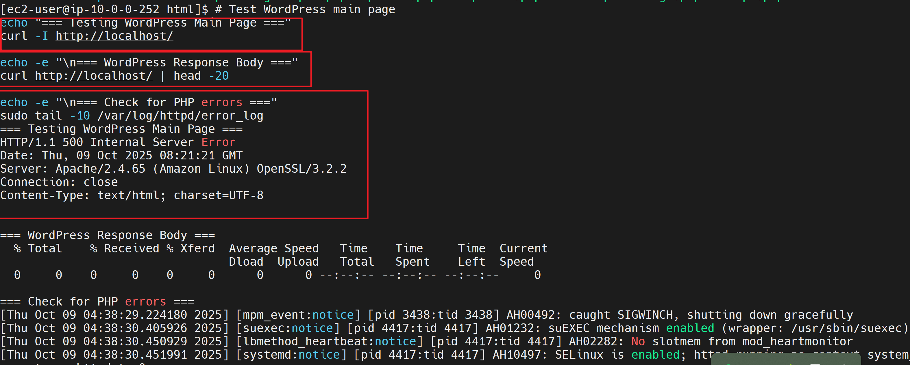
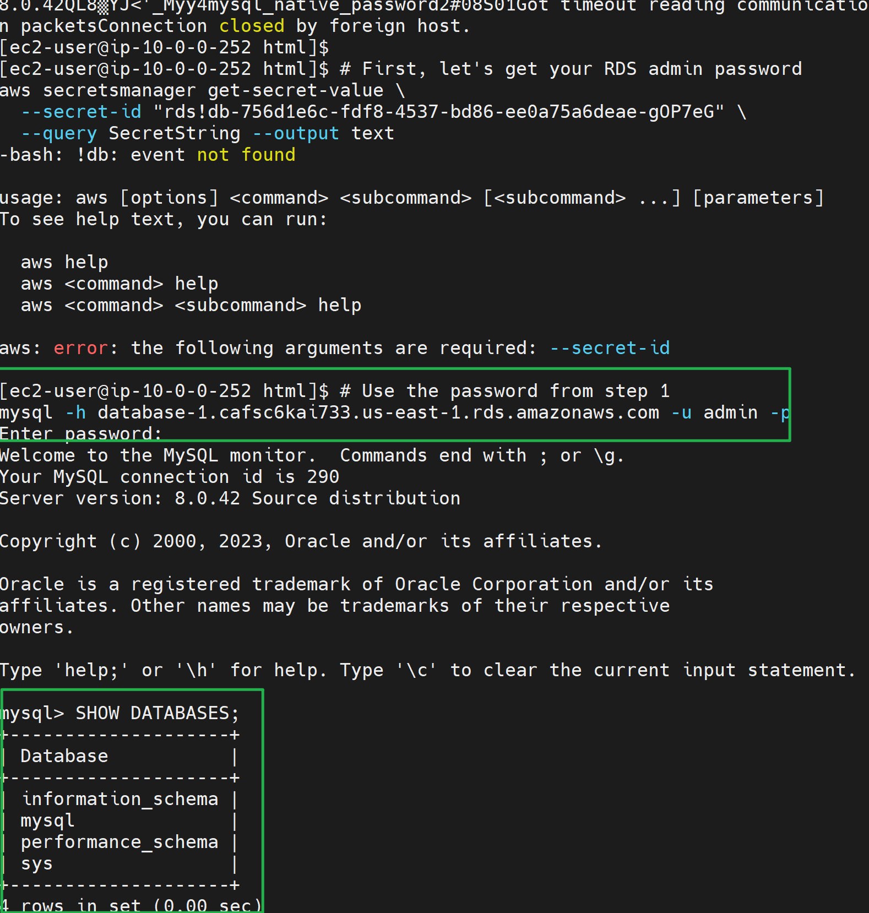

# DigitalBoost WordPress Website on AWS with EC2, EFS, RDS Database — Complete Setup Guide

---

## Project Overview

## Project Scenario

DigitalBoost, a digital marketing agency, requires a scalable, secure, and cost-effective WordPress solution that can handle client traffic and integrate seamlessly with existing infrastructure. This guide walks you through designing and deploying a robust, multi-AZ WordPress stack on AWS using best practices for networking, compute, storage, and security.


---

## Architecture Diagram


The deployment consists of:

- **VPC** (multi-AZ, public/private subnets)
- **Internet Gateway, NAT Gateway, Bastion Host** (public)
- **Application Load Balancer (ALB)**
- **EC2 Web Servers** (private, auto scaling)
- **Amazon RDS (MySQL)** (private)
- **Amazon EFS** (shared storage for web servers)
- **Route 53** (domain registration & DNS)
- **Security Groups** (detailed below)


## Prerequisites

- AWS Account with permissions for EC2, RDS, VPC 
- Basic Linux command line knowledge
- Familiarity with web servers and databases AWS

---

## Step 1: EC2 Instance Setup

### 1.1 Launch EC2 Instance

- Go to the **EC2 Dashboard** in AWS Console
- Click **"Launch Instance"**
- Configure:
  - **AMI**: Amazon Linux 2
  - **Instance Type**: t2.micro (Free Tier eligible)
  - **Key Pair**: Create or select existing
  - **Security Group**: Configure as below
  - 

## Create I am role for Devs You can name it after their role e.g


### 1.2 Security Group Configuration

| Type   | Protocol | Port Range | Source      | Description       |
|--------|----------|------------|-------------|-------------------|
| SSH    | TCP      | 22         | 0.0.0.0/0   | SSH access        |
| HTTP   | TCP      | 80         | 0.0.0.0/0   | Web traffic       |
| HTTPS  | TCP      | 443        | 0.0.0.0/0   | Secure web traffic|


### Step 1: VPC & Subnet Setup

**Objective:** Create a resilient network foundation.

**Steps:**
1. Create VPC (`10.0.0.0/16`) in `us-east-1`
2. Add **2 public subnets** (`10.0.0.0/24`, `10.0.2.0/24`) in different AZs
3. Add **2 private app subnets** (`10.0.1.0/24`, `10.0.3.0/24`)
4. Add **2 private data subnets** (`10.0.4.0/24`, `10.0.5.0/24`)
5. Attach Internet Gateway and set up public/private route tables





---

## Step 2: NAT Gateway & Bastion Host

**Objective:** Securely enable private subnet internet access; admin access via Bastion Host.

**Steps:**
1. Deploy NAT Gateway in public subnet for outbound internet from private subnets
2. Create Bastion Host EC2 in public subnet (SSH access restricted to your IP)
3. Update private route tables to use NAT Gateway

> **Screenshot Placeholder:**  



## Internet Gateway configurations


### Route 53


---

## Step 3: Security Group Architecture

| Component         | Port(s)  | Source           | Purpose                        |
|-------------------|----------|------------------|--------------------------------|
| ALB               | 80, 443  | 0.0.0.0/0        | Public web traffic             |
| Bastion Host      | 22       | Your IP          | Secure SSH admin access        |
| Webserver         | 80, 443  | ALB SG           | App traffic from ALB           |
| Webserver         | 22       | Bastion SG       | SSH from Bastion               |
| Database (RDS)    | 3306     | Webserver SG     | MySQL from web servers         |
| EFS               | 2049     | Webserver SG     | NFS for shared storage         |

##Screenshots


---

## Step 4: Amazon RDS (MySQL) Setup

**Objective:** Managed, scalable database with security isolation.

**Steps:**
1. Create RDS MySQL instance in private data subnet (multi-AZ, db.t3.micro/free tier if eligible)
2. Attach DB security group (allow 3306 only from webserver SG)
3. Record endpoint for WordPress config

###############################################################################################


---

## Step 5: Amazon EFS Setup

**Objective:** Scalable, shared file storage for all EC2 web servers.

**Steps:**
1. Create EFS file system
2. Add mount targets in both private app subnets (AZ1 + AZ2)
3. Attach EFS SG (allow 2049 from webserver SG)
4. Configure EC2 user-data to mount EFS on `/var/www/html`
5. Ensure WordPress uploads/media are stored on EFS


---
##Important step
**Objective:** Distribute client traffic across EC2 instances.

**Steps:**
1. Create ALB in public subnets
2. Set up listeners for HTTP/HTTPS
3. Create target group for EC2 instances
4. Set health check path (`/healthcheck.php`)
5. Attach ALB SG


## Attach Internet Gateway


---
---


p
## Step 6: EC2 Launch Template & Auto Scaling Group

**Objective:** Highly available, elastic WordPress web server layer.

**Steps:**
1. Build EC2 launch template:
   - Amazon Linux 2
   - Install Apache, PHP, required modules
   - Mount EFS (user-data script)
   - Deploy WordPress files
2. Create Auto Scaling Group:
   - Launch in both private app subnets
   - Minimum 2 instances (HA)
   - Scaling policy based on CPU or ALB traffic


  


## Step 2: Install and Configure Web Server

### 2.1 Install Apache, PHP, and Required Modules

```sh
sudo yum install -y httpd
sudo yum install -y php php-mysqlnd php-gd php-xml php-mbstring php-json php-curl
sudo systemctl start httpd
sudo systemctl enable httpd
sudo systemctl status httpd
```


### 2.2 Test Web Server

```sh
echo "<h1>HTML Test - Working!</h1>" | sudo tee /var/www/html/test.html
echo "<?php echo '<h1>PHP Test - Working!</h1>'; ?>" | sudo tee /var/www/html/test.php
sudo chown apache:apache /var/www/html/test.*
sudo chmod 644 /var/www/html/test.*
```
Test in browser:

- [http://your-ec2-ip/test.html](http://34.200.144.96/test.html)
- [http://your-ec2-ip/test.php](http://34.200.144.96/test.php)


##Troubleshoot
- [http://your-ec2-ip/test.php](http://34.200.144.96/readme.html)





---

## Step 3: RDS Database Setup

### 3.1 Create RDS Instance

- Go to **RDS Dashboard**
- Click **"Create database"**
- Engine: **MySQL 8.0.35**
- Template: **Free tier**
- DB Instance Identifier: `database-1`
- Master Username: `admin`
- Master Password: `your-secure-password`
- DB Instance Class: `db.t3.micro`
- Storage: **20 GB** (General Purpose SSD)
- VPC: Default
- Subnet group: Default
- Public Access: Yes (for demo)
- Security Group: Create new

> **Screenshot Placeholder:**  


### 3.2 RDS Security Group

| Type         | Protocol | Port Range | Source (EC2 SG ID) | Description                  |
|--------------|----------|------------|--------------------|------------------------------|
| MySQL/Aurora | TCP      | 3306       | EC2-Security-Group | Database access from EC2     |


### 3.3 Create WordPress Database and User

```sh
mysql -h database-1.cafsc6kai733.us-east-1.rds.amazonaws.com -u admin -p

CREATE DATABASE wordpress;
CREATE USER 'wpuser'@'%' IDENTIFIED BY 'WordPress123!SecurePass';
GRANT ALL PRIVILEGES ON wordpress.* TO 'wpuser'@'%';
FLUSH PRIVILEGES;
EXIT;
```

---

## Step 4: Test Database Connectivity
1. Copy WordPress files to `/var/www/html` (EFS mount)
2. Create and configure `wp-config.php`:
   - DB host: RDS endpoint
   - DB user: `wpuser`
   - DB password: strong password
   - Security salts from WordPress API
3. Complete installation via ALB DNS/domain in browser


### Autoscaling test, Alarm metrics and visual, hosted zone and testing


### 4.1 Create Database Test Script

```php
<?php
$connection = mysqli_connect('database-1.cafsc6kai733.us-east-1.rds.amazonaws.com', 'wpuser', 'WordPress123!SecurePass', 'wordpress');
if (!$connection) {
    echo '<h1 style="color: red;">Database connection failed: ' . mysqli_connect_error() . '</h1>';
} else {
    echo '<h1 style="color: green;">Database connection successful!</h1>';
    echo '<p>Connected to: ' . mysqli_get_host_info($connection) . '</p>';
    mysqli_close($connection);
}
?>
```
Save as `/var/www/html/db-test.php`  
Set permissions:

```sh
sudo chown apache:apache /var/www/html/db-test.php
sudo chmod 644 /var/www/html/db-test.php
```

### 4.2 Test Database Connection

- Visit: `http://your-ec2-ip/db-test.php`


---

## Step 5: WordPress Installation

### 5.1 Download and Extract WordPress

```sh
cd /tmp
wget https://wordpress.org/latest.tar.gz
tar -xzf latest.tar.gz
sudo cp -r wordpress/* /var/www/html/
sudo chown -R apache:apache /var/www/html/
sudo chmod -R 755 /var/www/html/
```


### 5.2 Configure WordPress

Create `wp-config.php`:

```php
<?php
define( 'DB_NAME', 'wordpress' );
define( 'DB_USER', 'wpuser' );
define( 'DB_PASSWORD', 'WordPress123!SecurePass' );
define( 'DB_HOST', 'database-1.cafsc6kai733.us-east-1.rds.amazonaws.com' );
define( 'DB_CHARSET', 'utf8mb4' );
define( 'DB_COLLATE', '' );

<?php echo file_get_contents('https://api.wordpress.org/secret-key/1.1/salt/'); ?>

$table_prefix = 'wp_';
define( 'WP_DEBUG', false );
if ( ! defined( 'ABSPATH' ) ) {
    define( 'ABSPATH', __DIR__ . '/' );
}
require_once ABSPATH . 'wp-settings.php';
?>
```
Set permissions:

```sh
sudo chown apache:apache /var/www/html/wp-config.php
sudo chmod 644 /var/www/html/wp-config.php
```

---

## Step 6: Troubleshooting and Optimization

### 6.1 Common Issues

**Filesystem Corruption**  
_Circular directory references causing infinite loops_

```sh
sudo mv /var/www/html /var/www/html_backup
sudo mkdir /var/www/html
sudo cp -r /tmp/wordpress/* /var/www/html/
```

**PHP Processing Errors**  
_"Primary script unknown" errors_

```sh
sudo yum install -y php
sudo systemctl restart httpd
```




### 6.2 Performance Optimization
### Data Base



Append to Apache config for performance and security:

```apacheconf
KeepAlive On
MaxKeepAliveRequests 100
KeepAliveTimeout 15

Header always set X-Content-Type-Options nosniff
Header always set X-Frame-Options DENY
Header always set X-XSS-Protection "1; mode=block"
```

Restart Apache:

```sh
sudo systemctl restart httpd
```

---

## Step 7: Final Testing and Verification

### 7.1 Comprehensive Testing

```sh
echo "=== Testing HTML ==="
curl http://localhost/test.html

echo "=== Testing PHP ==="
curl http://localhost/test.php

echo "=== Testing Database Connection ==="
curl http://localhost/db-test.php

echo "=== Testing WordPress ==="
curl -I http://localhost/
```


### 7.2 WordPress Setup Completion

- Visit: `http://your-ec2-ip/`
- Complete WordPress installation:
  - **Site Title**: Your WordPress Site
  - **Username**: admin
  - **Password**: Use a strong password
  - **Email**: your-email@example.com

Login to WordPress admin panel and customize your site.


---

## Step 8: Security Considerations

### 8.1 Security Best Practices

- Private subnets for web and DB servers
- NAT Gateway for secure outbound traffic
- Bastion Host for SSH (no direct EC2 access)
- Principle of least privilege for SGs
- RDS not publicly accessible
- EFS only accessible to web servers
- Regular updates, secure file permissions
- Security headers in Apache config
- HTTPS via ALB (add ACM/Let's Encrypt certificate as enhancement)

### 8.2 Monitoring and Maintenance

```sh
sudo tail -f /var/log/httpd/access_log
sudo tail -f /var/log/httpd/error_log
sudo yum update -y
sudo systemctl status httpd
sudo systemctl status mysqld
```

---

## Project Structure

```
wordpress-aws-project/
├── README.md
├── screenshots/
│   ├── architecture-diagram.png
│   ├── vpc-setup.png
│   ├── nat-gateway-setup.png
│   ├── bastion-host-setup.png
│   ├── security-group-architecture.png
│   ├── rds-setup.png
│   ├── efs-setup.png
│   ├── ec2-setup.png
│   ├── apache-installation.png
│   ├── auto-scaling-group.png
│   ├── alb-setup.png
│   ├── route53-setup.png
│   ├── wordpress-installation.png
│   ├── wp-config-setup.png
│   ├── final-testing.png
│   └── wordpress-dashboard.png
├── scripts/
│   ├── install-lamp.sh
│   ├── setup-database.sh
│   ├── deploy-wordpress.sh
└── config/
    ├── httpd.conf
    └── wp-config-template.php
```


---

## Lessons Learned

- **Filesystem Management**: Avoid directory corruption with atomic operations
- **Service Dependencies**: Understand Apache, PHP, and database interplay
- **Security Groups**: Correct network configuration is critical
- **Troubleshooting**: Use a systematic approach
- **Documentation**: Stepwise documentation aids reproducibility

---

## Future Enhancements

- SSL/TLS: Use Let's Encrypt or AWS Certificate Manager
- Load Balancing: Application Load Balancer for HA
- Auto Scaling: Configure for dynamic scaling
- Backups: Automate EC2 and RDS backups
- Monitoring: Integrate with CloudWatch
- CDN: Use CloudFront for performance
- IaC: Migrate to CloudFormation/Terraform

---

## Cost Optimization

- **EC2**: t2.micro (Free Tier)
- **RDS**: db.t3.micro (Free Tier)
- **Storage**: Minimal allocation
- **Data Transfer**: Optimize for low costs

---

## Conclusion

This guide demonstrates a successful WordPress deployment on AWS, with secure database connectivity, optimized web server, and a scalable cloud architecture.

- ✅ Functional WordPress website
- ✅ Secure database connectivity
- ✅ Proper security group configuration
- ✅ Troubleshooting steps
- ✅ Performance optimization
- ✅ Scalable architecture

---

> **Live Site:**  
> `http://your-ec2-public-ip/`

---
